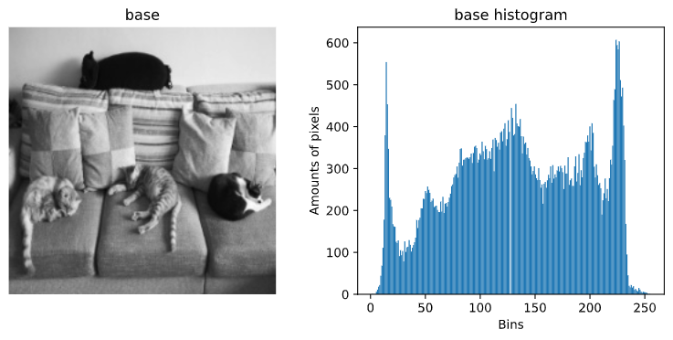
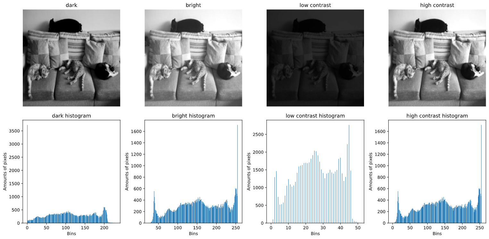
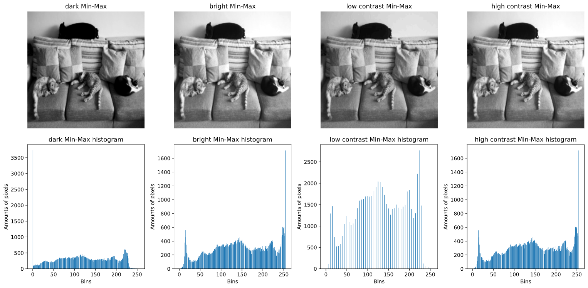
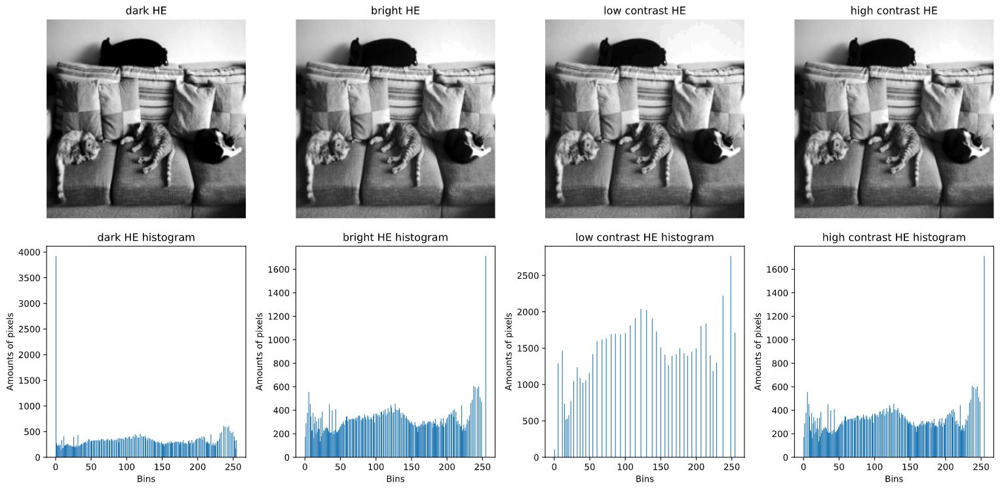
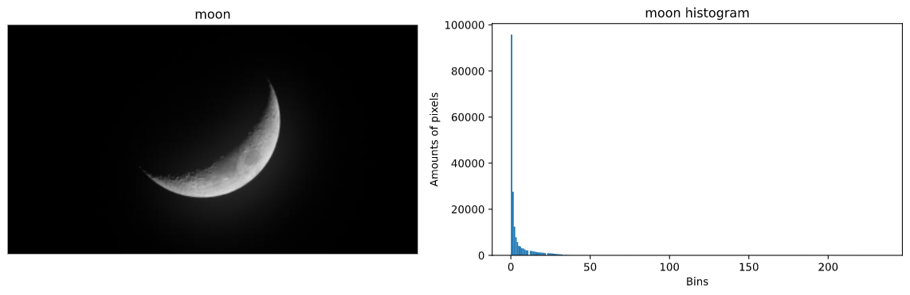
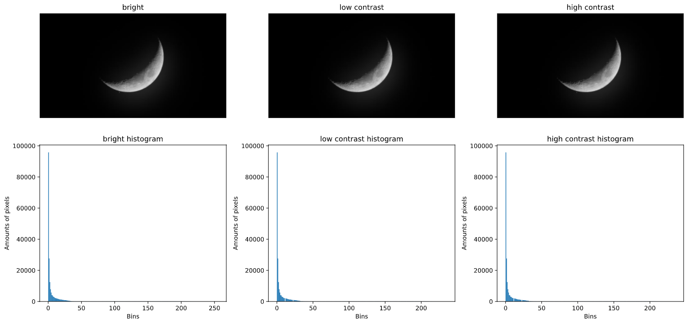
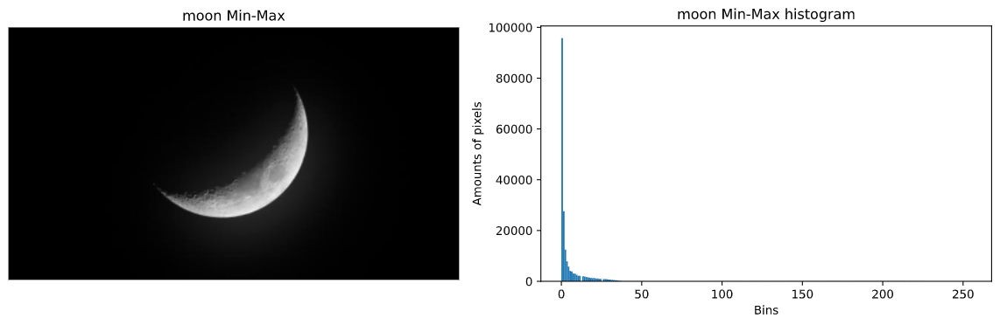
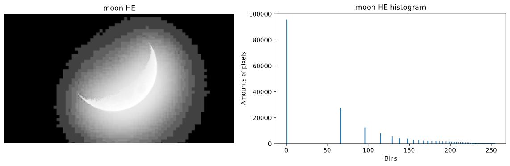

# Histogram-Equalization-and-Specification

Detail explanation and code are in `main.ipynb`

---

## 1. Please prepare four images: (a) dark (b) bright (c) low contrast (d) high contrast

### (a) Describe how you generate yourfour images. Show the images together with the corresponding histograms

I used python with opencv library to create four different images from a base image.
How I adjusted the image brightness is by adding a integer value called beta to each pixels. The value of alpha should be within -100 ~ 100 or the image after adjusted will be too bright or too dark.
How I adjusted the image contrast is by multiplying a float value called alpha to each pixels. If alpha value is within (0 ~ 1.0) then the output image will have lower contrast compared to original image. If alpha value is bigger than 1.0 then the output image will have higher contrast compared to original image.

### My base image and its histogram

### Four different images produced from different alpha and beta value

### Apply Min-Max Stretching

### Apply Histogram Equalization (HE)

## 2. Select one moon picture from the internet. Most area of the noon is nearly dark because there is only dim light there. Enhance the selected image by using equalization and specification, compare the results and give a discussion

### The moon image I found on internet

### Try to enhance the image by adjusting alpha and beta (doesn't work)

### Try to enhance the image using Mix-Max Stretching (doesn't work)

### Try to enhance the image using Histogram Equalization (doesn't work)

### Try to enhance the image using image editor (doesn't work)

